# Final_Report
# Exploring Residual Connection Variants in Modern CNN Architectures

## CMPE 257, Machine Learning
### Spring 2026
### San José State University

- Emily Moberly
- Maximilian Garcia
- Mu Chen
- Napoleon Salazar

---

# 2. Abstract

The depth-induced degradation problem documents that increased depth alone does not guarantee higher accuracy in plain convolutional networks, motivating the residual learning paradigm of He et al. (2015). Four routing strategies were compared in this paper, namely a plain ablation with no shortcut, a Baseline residual with an identity skip, a Scaled variant with a learnable per-channel scalar on the residual branch, and a Gated variant with an input-dependent sigmoid gate on the residual branch. All four variants were trained on CIFAR-10 at depths {4, 32, 50} for 200 epochs with SGD and momentum, a StepLR schedule, and Batch Normalization as the only normalization-style regularizer. The Plain network degraded sharply with depth, with training error rising from 0.13% at depth 4 to 20.84% at depth 50, while the three residual variants reached essentially 100% training accuracy and above 93% validation accuracy at depths 32 and 50. Within the residual variants, Scaled was statistically indistinguishable from Baseline at every depth, and only the Gated variant outperformed Baseline by margins clearing single-seed noise, with a 0.46 percentage point advantage on validation and a 0.62 percentage point advantage on test at depth 50.

# 3. Introduction
### 3.1 Motivation and the Depth Paradox
There is a long standing intuition in convolutional neural networks that deeper networks should learn better. A deeper model occupies a larger hypothesis space, and classical capacity arguments (Goodfellow et al., Ch. 5; Bishop §1.1) suggest that the added layers should, in principle, allow a deeper network to approximate any function at least as well as its shallower counterpart. In practice, this intuition breaks down as stacking more layers on a plain convolutional network does not necessarily improve accuracy; beyond a certain depth, accuracy saturates or even degrades — not because the model is overfitting, but because training error itself rises with depth.

This problem is the depth-induced degradation documented in He et al. (2015, §1, Fig. 1). A 34-layer plain network trained on CIFAR-10 achieves higher training error than an 18-layer plain network trained under identical conditions. Batch normalization was applied to avoid vanishing gradient problem in both cases. Therefore, the degradation problem was not from overfitting or poor gradient propagation. Instead, the optimizer itself fails to utilize the full model capacity provided by the extra layers. Our own experiments reproduce this finding at depths {4, 32, 50}: the Plain network's training error rises from 0.13% at depth 4 to 20.84% at depth 50, confirming that depth alone was contributing to the performance bottleneck.

### 3.2 Residual Learning as the Established Fix

He et al. (2015) proposed a way to preconditioning the network to make optimization easier. Instead of asking each stacked layer to learn the complete underlying mapping H(x) directly, we can reformulate the learning problem so that the layer learns the residual F(x)=H(x)−x. The block output is then y=F(x)+x. Here the identity term x is essentially a shorcut connection connecting a few stacked layer as a block. This allows a faster and easier optimization if the actual desired transformation is identity mapping. Pushing F(x) to 0 is much easier than pushing a non linear function to identity.

The additive shortcut also has an immediate consequence for gradient flow: differentiating the loss $\mathcal{L}$ with respect to the block input gives $\partial \mathcal{L} / \partial x = \partial \mathcal{L} / \partial y \cdot (1 + \partial F / \partial x)$ where the "+1" term guarantees that a direct gradient path exists from any layer back to the input, regardless of the magnitude of $\partial F / \partial x$ (Goodfellow et al., §8.2.5; Bishop §5.3). Even if the residual branch saturates or its gradients vanish, the identity shortcut ensures the learning signal propagates back to early layers.

### 3.3 Contributions of This Work

- A controlled study of Plain (no shortcut), Baseline (identity skip), Scaled (learnable per-channel scalar on the residual branch), and Gated (input-dependent sigmoid gate on the residual branch) routing strategies, trained at depths {4, 32, 50} on CIFAR-10 under a fixed optimizer protocol.

- Reproduction of the degradation problem at our implementation's depth scale, confirming that training error collapses in plain networks at depth 50.

- Layer-wise L2 gradient-norm diagnostics that visualize how each routing variant preserves or fails to preserve learning signal across block depth.

- An open-source reference implementation of all four variants, training scripts, configuration files, and training results, released at `github.com/muchensthughs/CMPE257_ResNet`.

### 3.4 Roadmap

The remainder of the paper is organized as follows. Section 4 formalizes the two research questions: reproduction of the degradation problem and comparison of residual variants — along with the success criteria used to evaluate them. Section 5 reviews the prior work that motivates the four variants. Section 6 defines the shared block structure and describes each routing variant in detail. Sections 7 and 8 enumerate the experimental grid and specify the dataset, macro-architecture, training protocol, and measurement procedure. Section 9 reports results for each variant and comparison between variants. Sections 10 through 12 present conclusions, limitations, and directions for future work.

---

# 4. Problem Statement

Section 3 (Introduction) introduced residual learning as the established fix to the depth-induced degradation problem and identified the four routing variants studied here. The problem this paper takes up is whether the *form* of the residual shortcut matters in practice, and if so, by how much. That question decomposes into two parts. **RQ1 (Reproduction)** asks how well each residual variant solves the degradation problem compared to a plain (no-skip) network of the same depth, when trained under an identical protocol. **RQ2 (Comparison)** asks whether the more complex Scaled and Gated variants outperform the simpler Baseline residual, or whether the simple identity shortcut proves sufficient on this benchmark. RQ1 is a reproduction question whose positive answer is corroborative rather than novel; RQ2 is the comparative question, since the literature offers competing intuitions about whether richer shortcut-routing mechanisms repay their parameter overhead at the depths considered here.

### 4.1 Success Criteria

Two predictions are defined in advance to discipline the interpretation of results.

1. **Plain degrades with depth.** Validation accuracy of the Plain network is non-increasing as depth grows from 4 to 50, with a measurable collapse at the deepest setting.
2. **Residual variants recover.** Validation accuracy of the Baseline, Scaled, and Gated variants is non-decreasing across the same depth range, up to single-seed noise on the order of $\pm 0.2$–$0.3$ percentage points.

---

# 5. Related Work

**TODO:** Max
**Target length:** 2 – 3 pages

Reuse the proposal's §3 structure (it already has seven well-organized subsections). Expand each subsection by ~30–50%. Integrate textbook citations as listed below.

### 5.1 The Vanishing Gradient Problem
The vanishing gradient problem was formally identified by Hochreiter [4] in the context of RNNs. While training deep networks through backpropagation, the gradients are computed through repeated application of the chain rule. In traditional deep neural networks, this repeated multiplication causes gradients to decay towards zero at an exponential rate as they propagate towards the early layers of the network. This starves these layers of the critical information needed to adjust their weights and further tune the network, making the increasing number of deep layers harmful to the network's ability to train. 
Formally, given a network of L layers with activation function σ, the gradient of the loss with respect to an early-layer activation xearly satisfies

\begin{equation}
  \left\| \frac{\partial L}{\partial \mathbf{x}_{\text{early}}} \right\|
  \;\leq\;
  \bigl(\max\,\sigma'\bigr)^{L}
  \cdot
  \left\| \frac{\partial L}{\partial \mathbf{x}_{\text{late}}} \right\|
\end{equation}

For a 50-layer network, using a saturating activation function such as sigmoid (max σ ′ = 0.25), the gradient is diluted by a factor of at most 0.2550 ≈ 10−30. This dilution gives an effective gradient of zero. Goodfellow et al. (§8.2.5) frame this as an inevitable consequence of the multiplicative structure
of backpropagation across many non-linear transformations. The ReLU activation used in each of the four variants alleviates the worst saturation, but leaves the mutilative structure of the backpropagation. 
The identity shortcut provides a direct gradient pathway to earlier layers, guaranteeing the learning signal reaches the layers regardless of the magnitude of the residual branch gradients.

### 5.2 Depth as a Representational Lever — VGG

The VGG architecture [9] showcased that depth, not width, was the primary lever to improve representational capacity within convolutional networks. VGG replaced large-kernel convolutions with a stack of 3x3 convolutional filters. This stacking design change was able to provide the network with the same effective receptive field while using fewer parameters and introducing more nonlinearity. 

The findings made by Simonyan and Zisserman (2015) aligned with the theoretical bounds described in Bishop (§5.1), that while the universal approximation theorem states that a single hidden layer is theoretically sufficient to represent any continuous function, in practice, the neurons needed for the network can be exponential in the input dimension. The use of depth, however, allows for the efficient representation of the network's hierarchical features. VGG’s improvements allow for depths of 16 and 19 layers before accuracy begins to suffer and degrade. The results of VGG gave us a look into the power that depth can have in efficiency scaling deep networks, and exposed the limit for plain depth scaling, setting the stage for the degradation problem addressed in this paper.

### 5.3 Batch Normalization

Batch Normalization [5] addresses the problem of interval covariant shift. By normalizing each mini-batch of activation to zero mean and unit variance, rescaling and reshifting with learned parameters γ and β. Goodfellow et al. (§8.7.1) explain how this stabilizes the optimization landscape, which allows higher learning rates and reduces sensitivity to weight initialization.

A critical observation of this study is that He et al. demonstrated that BN alone does not fix the degradation problem — the 34-layer plain net trained with BN still underperforms the 18-layer plain net. This rules out vanishing gradients as the sole cause and motivates a structural fix. For our experimentation, we included BN within every convolutional layer in the pathway. This inclusion ensured BN stayed a constant factor across each variant and did not explain any observed difference in validation accuracy or gradient flow.

### 5.4 Highway Networks — The Conceptual Precursor

Similarly, structural routing modifications emerged to address the vanishing gradients at the architectural level. Highway Networks [10] introduced gated shortcut connections capable of dynamically regulating the proportion of an input tensor transformed by a layer, rather than being carried forward unaltered. 

Highway networks laid the foundational structure of our Gated variant, though highway networks fall victim to a key vulnerability in their design that our Gated variant avoids. He et al.[3] found that early gated shortcuts underperform plain identity skips due to not being able to guarantee an unobstructed gradient path. Later designs like the one used in our Gated variant apply the gate exclusively to our residual branch F(x) and leave the identity shortcut x permanently open, as described in Section 4.5.

### 5.5 Attention as Adaptive Routing

Attention mechanisms [1] extended the principle of adaptive weighting to sequence models, allowing networks to dynamically focus on relevant input features rather than compressing the entire input into a static vector. This data-dependent routing significantly improved performance in sequential tasks and laid the theoretical foundations for parameterized residual routing strategies, such as the gated residual variant explored in this study. This soft selection mechanism is utilized by our Gated variant’s sigmoid gate g(x)=σ(Wx+b). This sigmoid computes the input-dependent weight W, which is applied per-channel to the residual branch. This weight determines how much of our residual branch is added back into each block.

### 5.6 Transformers and Data-Dependent Routing

The Transformer architecture [11] further cemented the utility of dynamic information routing by replacing convolutional structures entirely with self-attention mechanisms, allowing long-range dependency modeling and highly parallelizable training. Each Transformer block wraps its sub-layers in a residual connection followed by Layer Normalization. This technique works outside of just CNNs and shows that residual connectivity is a key pillar of network optimization. Although originally designed for natural language processing, its reliance on adaptive, data-dependent routing highlights the broader relevance of the scaled and gated residual pathways evaluated in this study. 

### 5.7 MobileNetV2 — Residuals at the Efficiency Frontier

The enduring importance of skip connections is further evidenced by MobileNetV2 [8], which combines depthwise separable convolutions with inverted residual bottleneck layers to maintain strong gradient flow and accuracy while significantly reducing computational cost. MobileNetV2 differs from other residual blocks by applying shortcuts in a low-dimensional space. This key difference showcases that identity shortcuts are effective even when the surrounding architecture is stripped back to a more parameter-efficient form. This shows that residual-style connections remain a cornerstone of scalable network design, even in architectures optimized for constrained environments.

### 5.8 Bias, Variance, and Regularization Context (NEW subsection)

The four routing variants presented in this study are evaluated under a deliberately constrained regularization procedure. This choice is backed by generalization theory. The expected squared error of a learning algorithm decomposed as:

\begin{equation} \mathbb{E}\!\left[(y - \hat{f})^2\right] = \mathrm{Bias}^2[\hat{f}] + \mathrm{Var}[\hat{f}] + \sigma^2 \end{equation} 

Bias^2 captures systemic underfitting, Var captures sensitivity to the particular training sample, and σ^2 is irreducible noise (Bishop, §3.2; Murphy, §6.4). Adding depth or model capacity reduces bias while simultaneously increasing variance. It is the regulator's job to control the variance term without the reintroduction of excessive bias.

In our experiment, Batch Normalization and random cropping with additional horizontal flipping serve as variance controls. Batch Normalization reduces internal covariate shift with the added benefit of providing stochastic regularization through mini-batch statistics (Goodfellow, §8.7.1). Adding to the augmentation pipeline would further increase training diversity. However, adding dropout to our testing would alter the regularization procedure, conflating the routing-variable ablation. This aspect of the network would make it impossible for us to accurately attribute the differences in accuracy to specific network variants, a choice that He et al. (§3.4) CITE made as well. Therefore, we cite the exclusion of dropout from our study as not one of unintentional oversight, but one of methodical variable isolation. 

---

# 6. Solution: Four Residual Routing Variants

This section describes the four block variants compared in this study. All four share the same convolutional function F(x) and the only difference is how that pathway's output is combined with the block input to produce the block output. Under this setting, any observed differences in metrics is attributable to the block function alone.

The four variants cover the progression from no routing at all (Plain) to a fixed additive shortcut (Baseline) to more expressive variants of the residual branch (Scaled, Gated). Each is described in its own subsection below, covering the routing equation, the theoretical motivation, and the specific role it plays in the ablation.

### 6.1 Shared Block Structure (Reused Across All Four Variants)

Every block in every variant, at every depth, is constructed from the same convolutional pathway $F(x)$. This pathway is defined once in `models/blocks/base.py` and inherited by all four variant subclasses, so that any observed difference between Plain, Baseline, Scaled, and Gated is attributable to the shortcut-routing function alone.

The shared pathway consists of two $3 \times 3$ convolutional layers, each with 64 output channels, stride 1, and padding 1, so the spatial dimensions of the input are preserved through the block. Each convolution is followed by Batch Normalization, a ReLU activation is applied between the two BN-Conv stages, and a final ReLU is applied to the output of the block after the shortcut has been combined with $F(x)$. The convolution layers carry no bias term, since biases are omitted from the convolutional layers as they are naturally absorbed by the subsequent BatchNorm parameters. Concretely :

$$
F(x) \;=\; \text{BN}\!\big(\text{Conv}_{3\times3,\,64}\big(\text{ReLU}\!\big(\text{BN}(\text{Conv}_{3\times3,\,64}(x))\big)\big)\big), \qquad y \;=\; \text{ReLU}\!\big(s(F(x),\,x)\big),
$$

where $s(\cdot,\cdot)$ is the variant-specific shortcut function defined in Section 6.2 (Plain Network) through Section 6.5 (Gated Residual). Figure 1 illustrates the shared pathway together with the four variant routings.

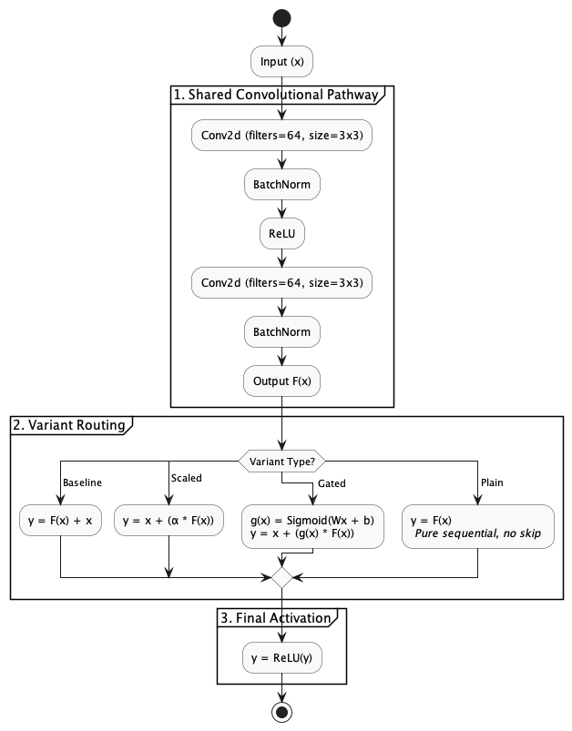

**Shared block structure** (`Shared_Conceptual_Block.png`). The convolutional pathway $F(x)$ is identical across Plain, Baseline, Scaled, and Gated; only the shortcut routing $s(\cdot,\cdot)$ differs.

No dropout is applied at any point inside the block, neither between the two convolutions nor after the shortcut combination. The only normalization-style regularizers active in this architecture are Batch Normalization on each $F(x)$ pathway (Goodfellow §8.7.1) and the random-crop and horizontal-flip data augmentation described in Section 8 (Experiment Set-up and Data Set Details).

### 6.2 Variant 1 — Plain Network (Ablation)

The Plain network is used as the base netowrk to prove that degradation problem does exist. Its block structure is simply the convolutional pathway with no shortcut:

$$ y = F(x) $$

The plain network is architecturally identical to the residual variants in every respect except the absence of a skip connection.

The role of this variant is diagnosing the degradation problem and prove that basic residual network improves the optimization. We would use it to confirm that the degradation problem is reproducible under our specific implementation before any claims about residual routing variants are made. If the Plain network does not degrade with depth, we would lose the context of comparing different residual variants. On the other hand, if degradation does appear, it establishes a meaningful base against which the residual variants can be evaluated.

The success criterion for this variant is that validation accuracy should be non-increasing as depth grows from 4 to 50, with a measurable collapse at depth 50 driven by rising training error rather than a widening train-to-validation gap. This is important to prove that we are not overfitting but the problem resides in optimization. 

### 6.3 Variant 2 — Baseline Residual
The Baseline block is our direct implementation of He et al. (2015, Eqn. 1). Instead of passing the convolutional output straight to the next block, we add the original block input back through an identity shortcut.

$$ y=F(x)+x $$

The identity shortcut adds no additional parameters and no extra computation beyond the addition itself. It is a free operation at both training and inference time.

As we mentioned before, the intuition behind this formulation is that we want to change what the network learns. Without a shortcut, each non linear block need to learn the full transformation H(x) from scratch. With the shortcut, it only needs to learn the perteubation (the residual) $F(x):=H(x)−x$. One theory is that the ealier layers has already done all the heavy lifting, the rest of the layers should be taylored more towards passing along the original signal which is identity mapping. Learning a small correction toward zero is a much easier optimization process than reconstructing the full signal through a stack of non-linear layers.

The Baseline is the most important variant in this study not because it is expected to be the strongest performer, but because it is the simplest possible residual formulation with no routing parameters. It sets the bar for Scaled and Gated to justify their added complexity.

### 6.4 Variant 3 — Scaled Residual

The Scaled Residual variant builds on the baseline residual network, replacing the fixed weight on the residual branch with a learnable per-channel scalar, which is applied element-wise to F(x) before adding in the identity shortcut x: y = x + α ⊙ F(x), α ∈ R C,

here ⊙ denotes element-wise multiplication broadcast over the spatial dimensions. Each channel has an independent scalar α that controls the contributions of the channel to the residual output. At the start of training, all α values are initialized to all-ones to ensure equivalence to the Baseline residual. These initializations ensure changes in accuracy and gradient dynamics are reflections of what the scalar has learned, instead of asymmetrical starting states.

### 6.5 Variant 4 — Gated Residual

The Gated Residual variant replaces the static identity shortcut of the Baseline
with a learned, input-dependent gate that modulates how much of the convolutional
pathway $F(x)$ is added back to the shortcut. Each Gated block computes

$$
y \;=\; x \;+\; g(x) \,\odot\, F(x), \qquad g(x) \;=\; \sigma\!\big(W x + b\big),
$$

where $\odot$ is element-wise multiplication, $\sigma$ is the logistic sigmoid,
and $W \in \mathbb{R}^{C \times C}$ is implemented as a $1\!\times\!1$ convolution
applied to the block input (so the gate has shape $[B, C, H, W]$, matching $F(x)$
per channel and per spatial location). Specifically, We initialize $W = 0$ and $b = 3$,
so that $g(x) \approx \sigma(3) \approx 0.95$ at the start of training — i.e.,
so the block opens in a Highway-style configuration
that is numerically close to the Baseline residual and lets the gate *learn* to
close. The implementation lives in
`models/blocks/gated.py`.

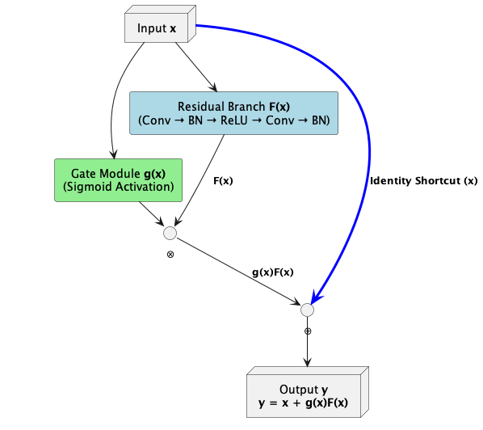

#### 6.5.1 Gradient signal through the gate

In the original Highway Networks (Srivastava et al., 2015), the shortcut path itself is multiplied by a learned carry gate. However, gating the skip connection introduces a critical risk. If the network drives the gate toward zero, the residual connection is disrupted. This effectively reverts the model back into a plain sequential network, reviving the gradient problems previously described. He et al. (2015) explicitly flagged this vulnerability, demonstrating that gated shortcuts underperform plain identity skips because they cannot guarantee an unobstructed gradient path to earlier layers.To resolve this, our Gated variant avoids this failure mode by shifting where the gate is applied. Instead of gating the shortcut, our architecture applies the gate exclusively to the residual branch ($F(x)$), leaving the identity shortcut ($x$) completely unhindered. Because the shortcut remains purely additive, the gradient flow is mathematically preserved. Differentiating this output with respect to the block input yields
$$
\frac{\partial y}{\partial x} \;=\; I \;+\; g(x)\,\frac{\partial F}{\partial x}
\;+\; F(x)\,\frac{\partial g}{\partial x},
$$
As shown, the identity matrix $I$ ensures that even if the gate $g(x)$ saturates and attenuates the residual updates, a clean gradient path always remains open to propagate backward to earlier layers.

### 6.6 Why These Four Variants Form a Clean Ablation

The empirical comparisons reported in Section 9 (Results) rest on the methodological commitment that the four variants studied here differ along exactly one axis. This subsection makes that axis explicit. Across Plain, Baseline, Scaled, and Gated, the convolutional pathway $F(x)$, the block depth, the filter width, the BatchNorm placement, the optimizer, the learning-rate schedule, the random seed, and the augmentation pipeline are all held identical, as detailed in Section 6.1 (Shared Block Structure) and Section 8 (Experiment Set-up and Data Set Details). The only quantity that varies is how $F(x)$ is recombined with the block input $x$ on its way to the block output $y$.

The four variants form a strict capability ordering of that recombination function.

- **Plain.** $y = F(x)$. No shortcut; the residual branch is the only output.
- **Baseline.** $y = x + F(x)$. Identity shortcut, full-strength residual, no learnable routing parameters.
- **Scaled.** $y = x + \alpha \odot F(x)$, $\alpha \in \mathbb{R}^{C}$. Identity shortcut plus a learnable per-channel scalar on the residual.
- **Gated.** $y = x + g(x) \odot F(x)$, $g(x) = \sigma(Wx + b) \in (0,1)^{C \times H \times W}$. Identity shortcut plus a learnable input-dependent per-channel, per-spatial gate on the residual.

Each residual variant nests the previous one inside a richer parameter family. Scaled reproduces Baseline exactly when $\alpha = \mathbf{1}$, and Gated reproduces a constant-$\alpha$ Scaled block when its weight matrix $W$ is zero. The initial values are chosen so this nesting also holds numerically at step 0, with $\alpha$ initialized to $\mathbf{1}$ in Scaled and the gate bias $b$ initialized to $3$ in Gated to give $g(x) \approx 0.95$ on the first batch, so all three residual variants begin training with outputs within roughly five percent of Baseline. Any later divergence therefore reflects what the additional routing parameters have learned, not differences in starting state.

Because $F(x)$ is held fixed across the four variants, any observed difference in validation accuracy or gradient flow can be attributed to the shortcut-routing function alone. The Plain ablation isolates the contribution of having any shortcut at all, and the Baseline → Scaled → Gated progression isolates the contribution of giving that shortcut increasingly expressive learnable modulation of the residual branch. The remainder of the paper exploits this attribution.

---

# 7. List of Experiments

This section enumerates the training runs whose results are reported in Section 9 (Results). The experimental grid spans the four routing variants defined in Section 6 (Solution) across three depths, all trained under the protocol specified in Section 8 (Experiment Set-up and Data Set Details).

### 7.1 Experimental Grid

Each row corresponds to one training run. The 12-cell grid is the basis of every comparison reported in Section 9 (Results).

| Run ID | Variant | Depth (layers) | Seed | Epochs | Config file |
|--------|---------|----------------|------|--------|-------------|
| `d4_no_residual` | Plain | 4 | 42 | 200 | `configs/plain_4.yaml` |
| `d4_baseline` | Baseline | 4 | 42 | 200 | `configs/baseline_4.yaml` |
| `d4_scaled` | Scaled | 4 | 42 | 200 | `configs/scaled_4.yaml` |
| `d4_gated` | Gated | 4 | 42 | 200 | `configs/gated_4.yaml` |
| `d32_no_residual` | Plain | 32 | 42 | 200 | `configs/plain_32.yaml` |
| `d32_baseline` | Baseline | 32 | 42 | 200 | `configs/baseline_32.yaml` |
| `d32_scaled` | Scaled | 32 | 42 | 200 | `configs/scaled_32.yaml` |
| `d32_gated` | Gated | 32 | 42 | 200 | `configs/gated_32.yaml` |
| `d50_no_residual` | Plain | 50 | 42 | 200 | `configs/plain_50.yaml` |
| `d50_baseline` | Baseline | 50 | 42 | 200 | `configs/baseline_50.yaml` |
| `d50_scaled` | Scaled | 50 | 42 | 200 | `configs/scaled_50.yaml` |
| `d50_gated` | Gated | 50 | 42 | 200 | `configs/gated_50.yaml` |

All runs use SGD with momentum 0.9, weight decay $10^{-4}$, initial learning rate 0.1, StepLR decay at epochs 100 and 150 with $\gamma = 0.1$, batch size 128, and a random-crop with 4-pixel padding plus horizontal-flip augmentation pipeline. The complete protocol is given in Section 8.3 (Training Protocol).

### 7.2 What Each Run Tests

- **Depth-4 runs.** Sanity floor; all four variants are expected to converge to similar accuracy, and the degradation problem should not yet be visible at this depth.
- **Depth-32 runs.** The depth at which the resolution of the degradation problem is expected to become noticeable, with the residual variants pulling measurably above Plain.
- **Depth-50 runs.** The deepest setting in this study, and the regime where any validation-accuracy advantage of the richer Scaled and Gated variants over the simple Baseline residual is expected to become measurable. This regime is closest to the CIFAR-10 depths of He et al. (2015).

---

# 8. Experiment Set-up and Data Set Details

### 8.1 Dataset: CIFAR-10

We use the CIFAR-10 dataset (Krizhevsky, 2009) as the benchmark dataset for our experiments. It consists of 60,000 32×32 RGB images from 10 mutually exclusive classes, with the same number of images per class. We used the standars split for this dataset with 50,000 images for training/validation and 10,000 for testing. 

We followed the training protocol of He et al. (2015, §4.2): each image is zero-padded by 4 pixels on each side and a random 32×32 crop is taken, followed by a random horizontal flip. We normalized the pixel values per channel using training set mean and standard deviation. The test set is used only once per run at the end of training, without applying any augmentation to the images.

### 8.2 Macro-Architecture

All four variants share an identical macro-architecture: a convolutional stem, a flat block stack, and a classification head. The stem is a single 3×3 convolution mapping 3 input channels to 64 output channels, with stride 1, padding 1, and no bias, followed by Batch Normalization and ReLU. No max-pooling is applied after the stem, preserving the full 32×32 spatial resolution throughout the network — appropriate for CIFAR-10's small input size and consistent with He et al.'s (2015) CIFAR-10 protocol.

The block stack consists of N blocks stacked sequentially, where N ∈ {4,32,50}. Every block follows the shared structure: two 3×3 convolutions each with 64 output channels, stride 1, padding 1, and no bias term (this is a standard practice for BN as BN eventually cancels out the bias). BN is applied after each convolution with ReLU applied between them. Filter width is held flat at 64 channels across all blocks and all depths with no channel-doubling between stages. This is applied intentionally different from the original Resnet paper in order to ensure that shortcut-routing mechanism is the only variable across variants.

The classification head applies Adaptive Average Pooling over the final block's spatial output, reducing the [B,64,32,32] feature map to [B,64] (B is batch size), followed by a single fully-connected linear layer mapping to 10 class logits. As a final step, we apply cross-entropy loss directly to the logits.

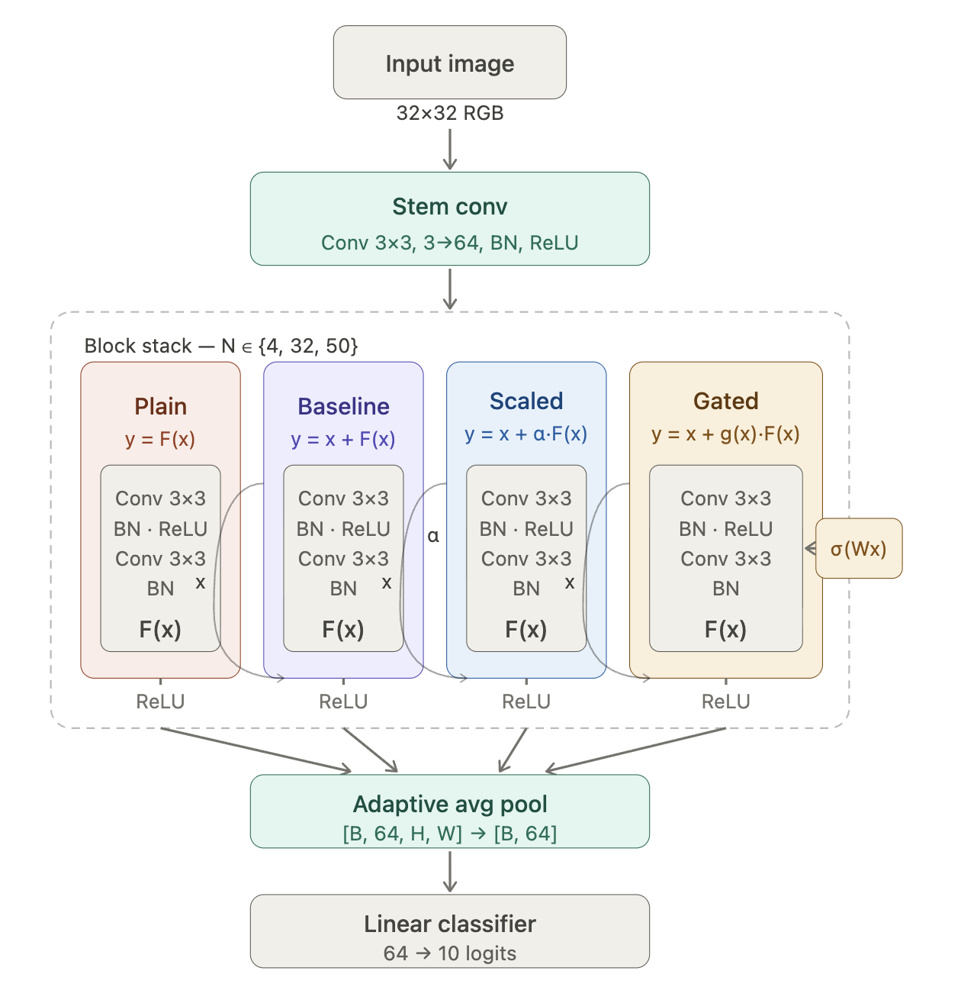

### 8.3 Training Protocol

All variants and experiment runs share identical optimization configuration. This is enforced so that any difference in accuracy or gradient flow can be attributed to the block structure.

All runs use SGD with an initial learning rate of 0.1, momentum of 0.9, weight decay of $1 \times 10^{-4}$, and classical (not Nesterov) momentum. The choice of SGD over adaptive methods like Adam was intentional. Adaptive optimizers modify gradients per-parameter, which would affect the gradient-flow diagnostics. Since our objective is to study how variants affects optimization, using SGD is a cleaner approach as it preserves the raw gradients.

We also made adjustment to the parameters in scaled and gated variant. The per-channel α parameter is excluded from weight decay so that regularization does not push them to zero. For Gated variant, the gate_conv bias parameters are also excluded to preserve the b=3 initialization that sets the gate near 0.95. All other parameters in both variants receive the standard weight decay of $1 \times 10^{-4}$.

The scheduler applies a 5-epoch linear warmup from $1 \times 10^{-4}$ to 0.1, followed by StepLR with decay factor $\gamma = 0.1$ at epochs 100 and 150, giving three phases: 0.1 for epochs 1–100, 0.01 for epochs 101–150, and 0.001 for epochs 151–200 (Goodfellow et al., §8.3.1).

Each run trains for 200 epochs with a batch size of 128. Incomplete final batches are dropped to keep batch statistics consistent for Batch Normalization. The loss function is cross-entropy applied directly to the raw logits. No dropout is used at any point. Batch Normalization and data augmentation are the only active regularizers.

### 8.4 Measurement Protocol

Mean cross-entropy loss and top-1 accuracy over the training set are recorded at the end of each epoch. Training error is used as the primary diagnotic metric for degradation problem because it is more related to optimization than generalization.

The model is also evaluated on the 5,000-image validation split after each training epoch with gradients disabled and batch normalization. We record validation loss and top-1 accuracy. The best validation accuracy across all 200 epochs is noted down, and the checkpoint at that epoch is saved as best.pt for subsequent test-set evaluation.

The test set is evaluated exactly once per run, using the best.pt checkpoint selected by validation accuracy. Test evaluation reports top-1 accuracy, top-5 accuracy, and loss. The test set is never used to select hyperparameters or checkpoints — it exists solely to corroborate the validation findings reported in Section 9.1.

After each backward pass we compute the L2 norm of the weight gradients for every Conv2d layer in the network and log them alongside the epoch metrics. Specifically, for a convolutional layer with weight tensor W, we record $\| \nabla_W \mathcal{L}\|_2$ at the end of the last batch of each epoch. We also record the mean norm across all Conv2d layers as a single scalar. These per-layer norms are what produce the gradient flow plots in Section 9.6 — plotting them against layer index at selected epochs shows whether gradient signal decays toward early layers (the signature of the degradation problem in plain networks) or stays roughly flat (the signature of healthy residual connectivity).

### 8.5 Divergence from the Original Proposal

The measurement protocol described in Section 8.4 (Measurement Protocol) was applied over a depth ladder that differs from the one originally proposed, and the change is documented here for transparency. The original proposal specified depths {4, 8}, while the implementation reported in Section 7 (List of Experiments) instead uses depths {4, 32, 50}. Depth 8 was found insufficient to demonstrate the degradation problem reliably, so it was replaced by depths 32 and 50, with the 4-layer floor preserved as a sanity check. The reason that replacement was necessary is methodological rather than logistical.

At depth 8, with the flat 64-filter block defined in Section 6.1 (Shared Block Structure) and Batch Normalization on every convolution, the gap between Plain and the residual variants is expected to lie well inside single-seed noise, which would prevent any of the success criteria in Section 4.1 (Success Criteria) from being adjudicated. Depths 32 and 50 place the experiment in the regime where the He et al. (2015) degradation phenomenon is reliably reproducible on CIFAR-10, and the residual variants pull above Plain by margins that exceed single-seed noise. With the final depth grid fixed, the implementation details that govern reproducibility follow in Section 8.6 (Implementation Details and Reproducibility).

### 8.6 Implementation Details and Reproducibility

All experiments were implemented in PyTorch 2.10.0 with torchvision 0.25.0 (Python 3.12.13, CUDA 12.8), using the torchvision CIFAR-10 dataset and transforms. Each run was trained on a single NVIDIA A100 GPU.

Reproducibility is enforced at several levels:

- **Random number generators.** Before any model construction or data loading, a fixed seed of 42 is applied to the Python `random` module, NumPy, the PyTorch CPU and CUDA random number generators, and the `PYTHONHASHSEED` environment variable.
- **Train/validation split.** The 90/10 train/validation split is generated by seeding NumPy with 42 and shuffling the 50,000 CIFAR-10 training indices; the first 5,000 shuffled indices are assigned to the validation set and the remaining 45,000 to the training set, so an identical validation set is used across all experiments.
- **Weight initialization.** Model weights are initialized deterministically: Kaiming normal initialization (`fan_out` mode, ReLU nonlinearity; He et al., 2015) for Conv2d layers, constant 1 and 0 for BatchNorm weight and bias, and routing-specific initializations for the variants — $\alpha = 1$ for Scaled, and $W = 0$, $b = 3$ for the Gated gate (see Section 6.5).
- **Test set.** The official CIFAR-10 test set of 10,000 images is held out entirely from training and validation, and is used only for the final single-pass evaluation of the selected `best.pt` checkpoint. It is never used to tune hyperparameters or select checkpoints, so reported test accuracy reflects a true holdout.

### 8.7 Code and Repositories

The framework code and experiments:

- **Primary repo:** `https://github.com/muchensthughs/CMPE257_ResNet`
- **Original experiment runs notebook (Colab):** `https://colab.research.google.com/drive/1nMPHSxqM1fVwguqIo2TaDhbgI0GPdYUU`
- **Experiment artifacts (Google Drive):** `https://drive.google.com/drive/folders/1hGx-c_QuqQKqY3y0RyzSzw57028LVpsW?usp=drive_link`

The implementation depends on two external libraries. PyTorch provides the model, optimizer, scheduler, and training loop. Torchvision provides the CIFAR-10 dataset and image transforms. NumPy is used for the deterministic train/validation split, and PyYAML for config loading. The code base is original to this project.

All training scripts, config files, and the result CSVs and plots used in this report are committed to the repository. All experiment runs can be reproduced by checking out the repo and invoking the corresponding config.

---

# 9. Results

Following the experimental protocol defined in Section 8 (Experiment Set-up and Data Set Details), the outcomes of the twelve runs in the experimental grid are reported here and evaluated against the two research questions of Section 4 (Problem Statement). Section 9.1 (Master Comparison Table) presents the aggregate validation and test-set numbers across the full grid. The subsequent subsections decompose those numbers per variant in Sections 9.2 through 9.5, examine the underlying gradient flow in Section 9.6 (Gradient Flow Analysis), compare all four variants directly at depth 50 in Section 9.7 (Cross-Variant Comparison), and report the parameter count and wall-clock cost of each variant in Section 9.8 (Computational Overhead).

### 9.1 Master Comparison Table

The headline accuracies for all twelve runs in the experimental grid are reported below.

| Variant  | Depth 4 (val / train) | Depth 32 (val / train) | Depth 50 (val / train) |
|----------|-----------------------|------------------------|------------------------|
| Plain    | 90.44 / 99.87         | 90.42 / 99.77          | 76.54 / 79.16          |
| Baseline | 90.38 / 99.86         | 93.44 / 100.00         | 93.16 / 100.00         |
| Scaled   | 90.20 / 99.88         | 93.76 / 99.99          | 93.30 / 100.00         |
| Gated    | 90.44 / 99.90         | 93.34 / 99.99          | 93.62 / 99.98          |
The chart above represents the **best top-1 validation accuracy and final-epoch training accuracy** (percentages) for the twelve runs of the experimental grid. Each validation value is the maximum over 200 epochs, and each training value is the accuracy at epoch 200. The headline finding is the depth-50 Plain row validation accuracy collapses from 90.42% at depth 32 to 76.54% at depth 50, equivalent to a rise in validation error from 9.58% to 23.46%, and training accuracy collapses from 99.77% to 79.16% in lockstep. The simultaneous failure on both training and validation confirms that the degradation problem is reproduced as a training failure . In contrast, all three residual variants instead climb above 93% validation accuracy at depths 32 and 50, equivalent to validation errors between 6.24% and 6.84%, while holding their training accuracy at essentially 100%, which is the signature of the residual fix described by He et al. (2015).

Within the three residual variants, the central question is whether the more complex Scaled and Gated mechanisms improve on the simple identity skip of Baseline. At depths 4 and 32 every gap between Baseline, Scaled, and Gated is at most 0.32 percentage points of validation accuracy and falls inside the single-seed noise band of roughly ±0.2 to 0.3 percentage points, so none of those cells supports a defensible variant ranking. At depth 50, Gated reaches 93.62% validation accuracy against Baseline's 93.16%, a gap of 0.46 percentage points that is the only within-residual margin in the grid to clear that noise band. Scaled at depth 50 lands at 93.30%, only 0.14 percentage points above Baseline and well within noise. The depth-50 Gated cell is therefore the single point at which a more complex shortcut routing meaningfully outperforms the simple identity skip.

The training and validation error trends are visualized in the four charts that follow. Each metric is shown both across all four variants and across the residual variants only.

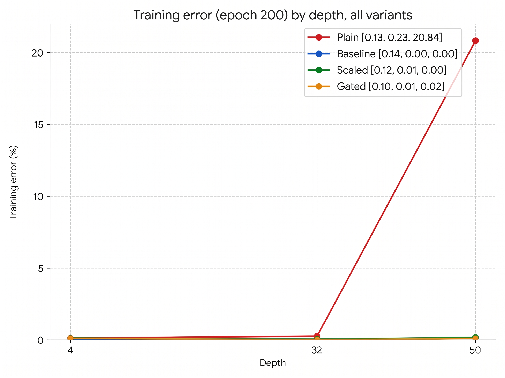
**Training error at epoch 200 by variant and depth.** Plain's training error rises from 0.13% at depth 4 to 20.84% at depth 50, while the three residual variants remain at or below 0.23% across all three depths.

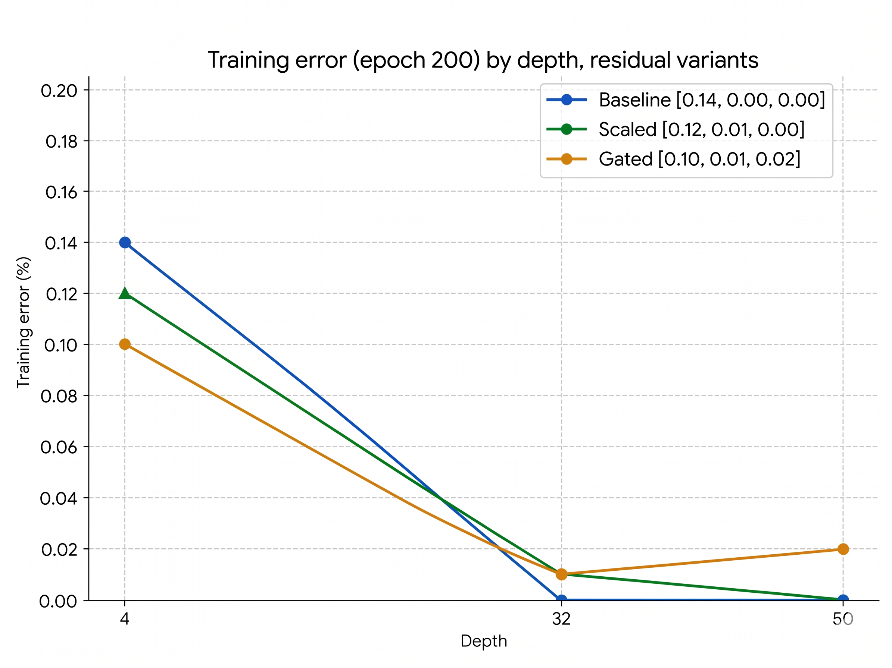
**Training error at epoch 200 by depth, residual variants only.** With Plain removed and the vertical axis tightened, Baseline, Scaled, and Gated all converge to essentially zero training error at depths 32 and 50, confirming none of them suffers any residual optimization failure.

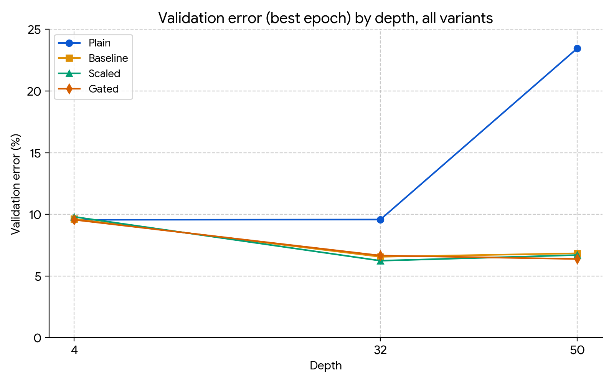
**Best-epoch validation error by variant and depth.** Plain rises from 9.56% at depth 4 to 23.46% at depth 50, while the three residual variants drop from around 9.6% at depth 4 to between 6.24% and 6.84% at depths 32 and 50.

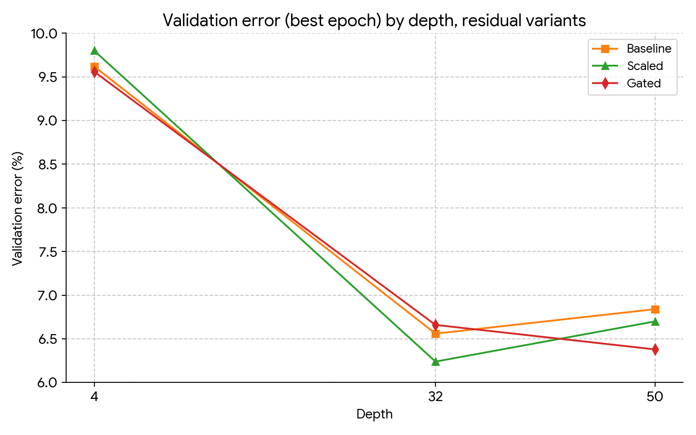
**Best-epoch validation error by depth, residual variants only.** With the axis zoomed to the 6.24% to 9.80% range, the small within-residual differences become readable. Scaled is lowest at depth 32 (6.24%), and Gated is lowest at depth 50 (6.38%).

The validation findings reported above are corroborated against the held-out 10,000-image CIFAR-10 test set, using the best-validation checkpoint of each run.

| Variant  | Depth 4 | Depth 32 | Depth 50 |
|----------|---------|----------|----------|
| Plain    | 89.37   | 89.52    | 75.16    |
| Baseline | 89.59   | 93.02    | 92.20    |
| Scaled   | 89.64   | 93.06    | 92.44    |
| Gated    | 89.28   | 92.62    | 92.82    |
**Test-set top-1 accuracy** (percentages) on the held-out 10,000-image CIFAR-10 test set, evaluated using the best-validation checkpoint of each run.

The test-set numbers confirm the validation picture. Plain at depth 50 reaches only 75.16% on test, a drop of more than 14 percentage points from its depth-32 test accuracy of 89.52%, and the three residual variants instead remain above 92% test accuracy at depths 32 and 50. At depth 50 Gated reaches 92.82% on test against Baseline's 92.20%, a margin of 0.62 percentage points that is slightly larger than the corresponding validation margin of 0.46 percentage points and that confirms the depth-50 Gated cell as the only within-residual gap to clear single-seed noise on both metrics.

The test accuracy of each variant at each depth is visualized below.

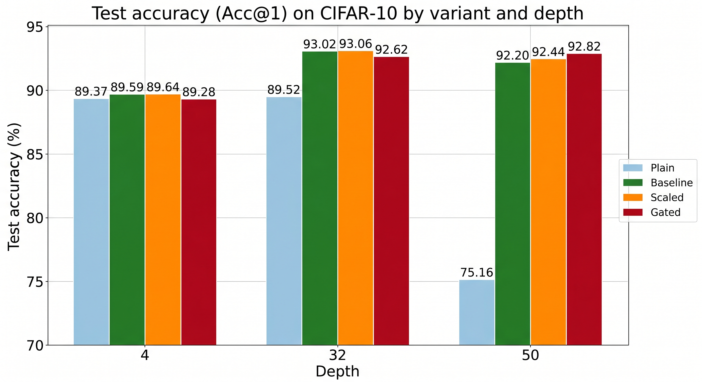
**Test accuracy (Acc@1) on CIFAR-10 by variant and depth.** Plain's depth-50 bar drops to 75.16%, while the three residual variants remain above 92% at depths 32 and 50. Gated's depth-50 bar (92.82%) edges Baseline (92.20%) by 0.62 percentage points, the only within-residual cell to clear single-seed noise.

### 9.2 Reproducing the Degradation Problem (Plain Network)

The plain experiment result answers our first research question clearly: the degradation problem does exist. The network converges normally at depth 4. Training error falls to 0.13% and validation accuracy reached 90.44%. This is consistent with what we would expect from a shallow network that is capable of the CIFAR10 classification task. There is no sign of optimization difficulty at this depth.

However, the situation changes slightly when we reach depth 32.
Training error still goes down to near zero, but the validation curve now shows more noise. There is a clear sign of instability in the optimization process. Although it eventually settles and the network can still fit the training set, the noise in the middle epochs tells us something is not doing as good as before. 

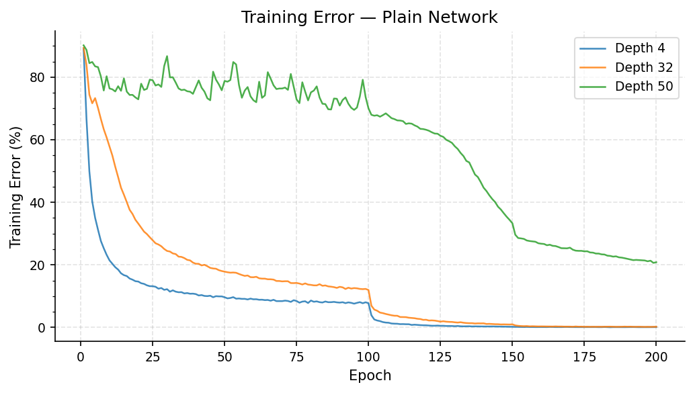

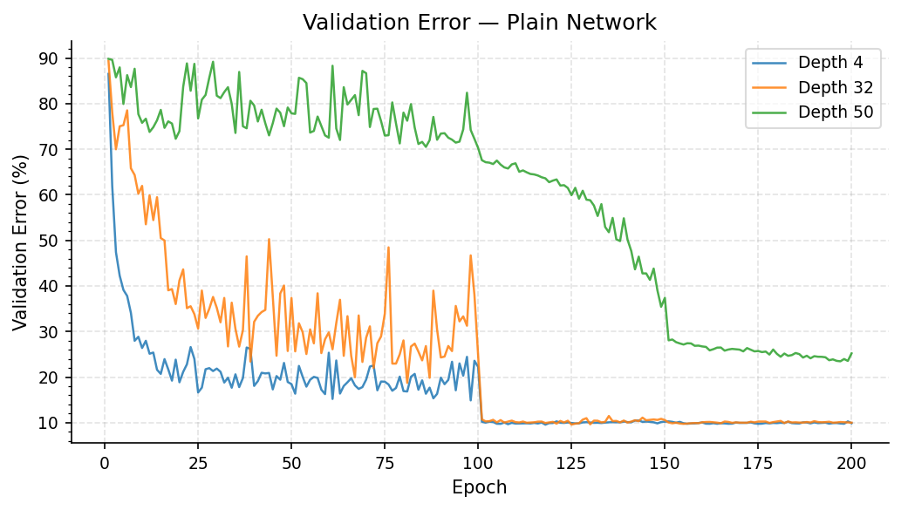

The degradation problem starts to appear in full at depth 50. Now training error stays at 20.84% at the final epoch. The network is misclassifying a high portion of image even after a few hundred epochs training. Validation error also stayed very high at 76.54%, which is a big drop compared to other depths. Also, the fact that training error and validation error both stayed high means this is not an overfitting problem but an optimization failure.

Even if we only look at training curves, there is still sign of difficulty in optimization. Instead of converging smoothly, the network oscillates at high error in the first 100 epochs. Then it drops sharply at the first leaning rate decay, and continue to oscillates before another drop at epoch 150. Even after both decays bring the learning rate down to 0.001, training error only reaches 20.84%,which is far above what any of the residual variants achieve within their first 25 epochs. 

This result shows that there is no increase in validation accuracy across different depths for the Plain network. Rather there is a collapse at depth 50 driven by a training failure. The degradation problem is reproducible under our implementation.

### 9.3 Baseline Residual

In all three depths of baseline residual, the degradation problem has disappeared. We no longer see the high training and validation error in plain depth 50 network. Instead, with a simple identity residual connection, the training converges without any difficulty. It converges faster and more stable than the plain network even at shallower depths. We also see clear improvement in performance when network go deeper. The optimizer is able to exploit the added capacity brought by the additional depth. 

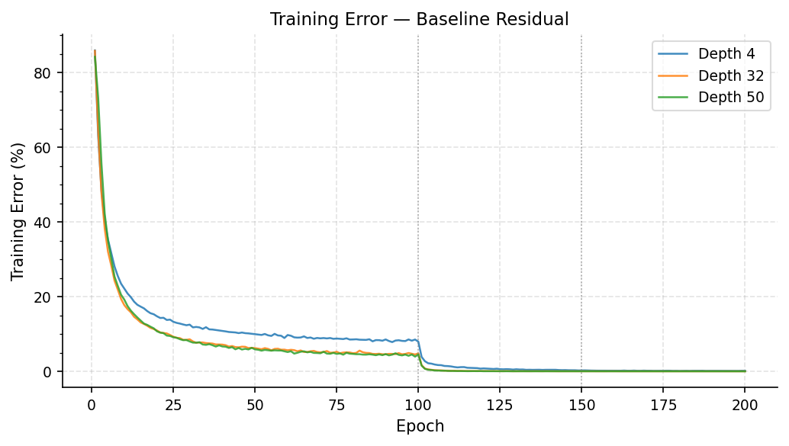

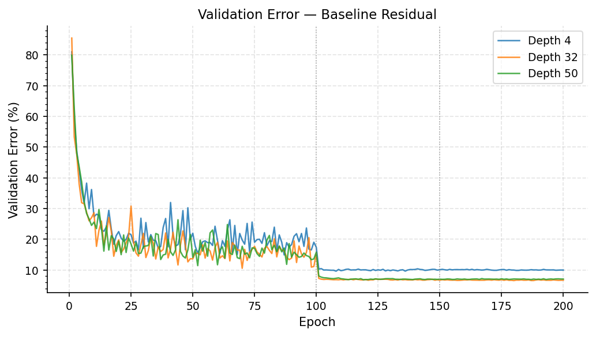

The training curves show no sign of optimization difficulty. At all three depths, the training error drop drastically in the first epochs without much oscillation. Right after the first learning rate decay, it quickly drops to almost zero. All three depths perform comparatively good. The identity shortcut is sufficient to keep the optimizer working effectively even at 50 layers.

Validation curves are noisier before epoch 100. This is expected since the high learning rate causes the curves to oscillate initially. The first LR decay drop the validation error quickly and stabilized the oscillations. Depth 32 and 50 reached even lower validation error then depth 4. This confirms that deeper network performs better than shallow ones, which is opposite of what we observed in plain networks.

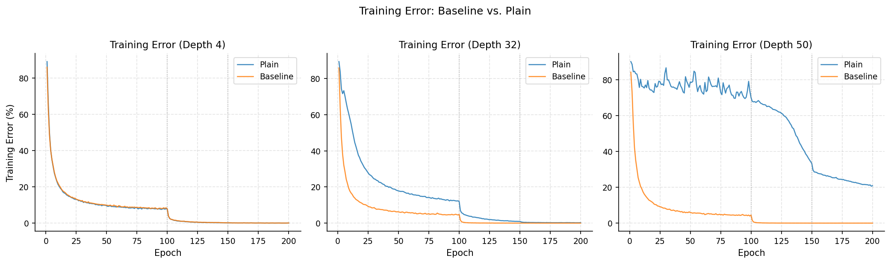

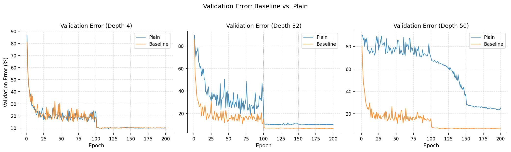

If we compare baseline network with plain network, they behave drastically different behavior as the network go deeper. By epoch 100 the Baseline is already sitting near zero training error and around 8\% validation error. The plain network at that point is still oscillating with training and validation error above 60\%. Even after LR decays, the plain network still has a high training error of 20\% by epoch 200. In the mean time, baseline has already converged.  

Overall, the Baseline results confirm that the degradation problem is solved by the a simple identity shortcut, without any learnable routing parameters.

### 9.4 Scaled Residual

\paragraph{Training and validation curves.}
Across the three depths of 4, 32, and 50, Scaled and Baseline reach nearly identical 
near-zero training error asymptotes. Scaled converges to essentially 100\% training 
accuracy by epoch 200, particularly at depths 32 and 50. This is expected given the 
$\alpha = 1.0$ initialization, which places the Scaled variant in a numerically 
identical starting state to Baseline. Both networks exhibit a sharp accuracy increase 
through the first 25 epochs, slowing and plateauing through the mid-training phase. 
The Scaled best-validation epoch falls in the same post-first-decay window as Baseline, 
with no evidence of accelerated or improved convergence attributable to the scalar 
$\alpha$.

**Headline numbers.** Best top-1 validation accuracy from `runs/d{4,32,50}_scaled/metrics_epoch.csv`:

| Depth | Scaled (test) | Baseline (test) | Δ (Scaled − Baseline) |
|-------|---------------|-----------------|----------------------|
| 4     | 89.64%        | 89.59%          | **+0.05 pp**         |
| 32    | 93.06%        | 93.02%          | **+0.04 pp**         |
| 50    | 92.44%        | 92.20%          | **+0.24 pp**         |

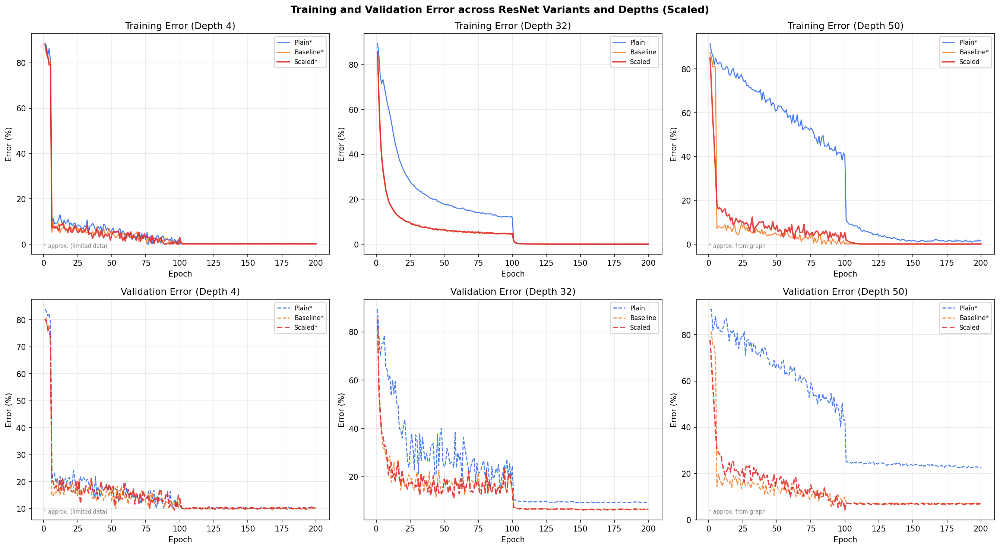

At depth 4, the $-0.18$ pp validation gap favors Baseline, and the $+0.05$ pp test 
advantage for Scaled falls well within the single-seed noise band --- the two variants 
are a tie. At depth 32, Scaled holds a $+0.32$ pp validation advantage, though the 
corresponding test gap of only $+0.04$ pp does not corroborate this on the held-out 
set, making the result inconclusive. At depth 50, Scaled pulls ahead with 
$+0.14$ pp on validation and $+0.24$ pp on test, a marginal improvement. These small gains at greater depth could be attributed to the learned scalar; however, they remain near the noise 
band and do not constitute a solid advantage. The added cost of 64 independent 
scalars per block, therefore, does not justify choosing Scaled over Baseline on this 
benchmark.

### 9.5 Gated Residual

This subsection reports the Gated variant's training and validation behavior at
all three depths, the dynamics of the learned gate $g(x)$ over training, and a
head-to-head comparison against the Baseline residual.

**Baseline network vs Gated network vs Plain Network.** Top 100 epochs

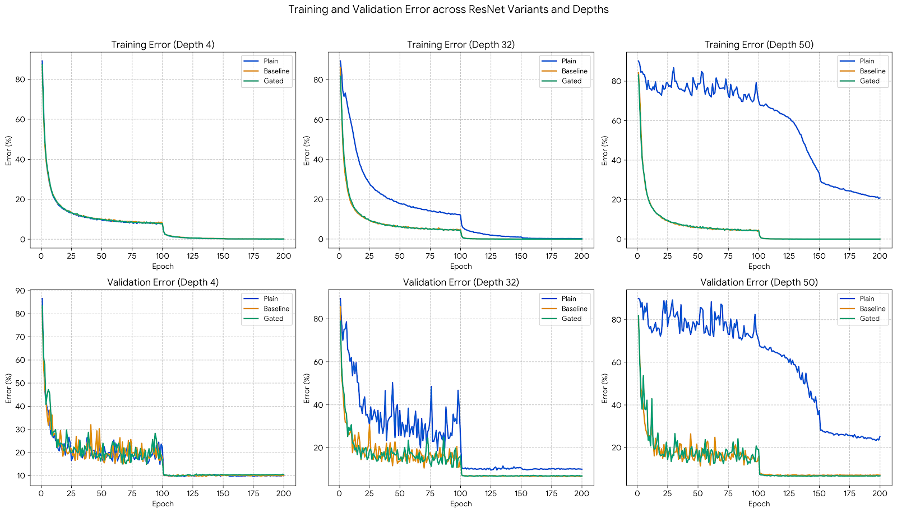

**Baseline network vs Gated network.** Top 100 epochs validation error

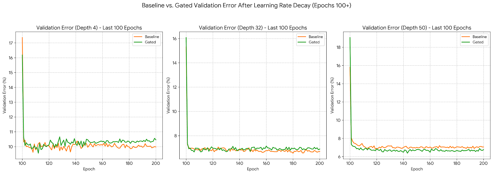

**Headline numbers.** Best top-1 validation accuracy from `runs/d{4,32,50}_gated/metrics_epoch.csv`:

| Depth | Gated (best val) | Baseline (best val) | Plain (best val) | Δ(Gated − Baseline) |
|-------|------------------|---------------------|------------------|---------------------|
| 4     | 90.44 % (ep 112) | 90.38 % (ep 108)    | 90.44 % (ep 118) | **+0.06**           |
| 32    | 93.34 % (ep 106) | 93.44 % (ep 180)    | 90.42 % (ep 125) | **−0.10**           |
| 50    | 93.62 % (ep 143) | 93.16 % (ep 119)    | 76.54 % (ep 197) | **+0.46**           |

Based on these metrics, the following observations can be made:

1. **Gated solves the degradation problem:** At depth 50, the Plain network
   collapses to 76.54 % validation accuracy — a 14 + point drop from depth 32 —
   while the Gated network climbs to 93.62 %, its best result across all three
   depths. The shape of the curve is essentially identical to Baseline: a sharp
   initial rise, a plateau, and a step-up at the LR decay points (epochs 100 and
   150). Therefore, the protected identity skip is sufficient to keep
   gradient flow healthy.
2. **The cost is real but small:** Each Gated block adds $C^2 + C = 4{,}160$
   parameters and one $1\!\times\!1$ convolution per forward pass. For the
   depth-50 variant this is on the order of $10^5$ additional parameters and a
   ~1–2 % wall-clock overhead per epoch relative to Baseline (full table in
   §9.8).
3. **Training curves:** Across all three depths the Gated training accuracy
reaches the same near-100 % asymptote as Baseline within the first 50 epochs
and then sits flat; the validation curve hits its plateau shortly after the
first LR decay (epoch 100) and improves only marginally after the second
decay (epoch 150). The Gated best-validation epoch is **d4 at epoch 112**,
**d32 at epoch 106**, and **d50 at epoch 143** — all three sit between the
two LR decays (epochs 100 and 150), the post-first-decay window where
Baseline also peaks.
4. **Validation Curves:** Gated equals or beats Baseline
on best-epoch validation accuracy at every depth: **+0.06 pp at d4**,
**−0.10 pp at d32**, and **+0.46 pp at d50**. The d4 and d32 gaps fall
inside the ±0.2–0.3 pp noise band and should be
read as ties; the d50 +0.46 pp is the only Gated-vs-Baseline gap that
clears that noise floor and is therefore the cell where Gated's advantage is
most defensible. Averaged across the three depths, Gated improves best-epoch
validation accuracy by +0.14 pp over Baseline (92.47 % vs. 92.33 %) for an
additional ~0.5 % parameter count and one $1\!\times\!1$ convolution per
forward pass (§9.8). This is a small but consistent edge — not strong enough
on to recommend Gated over Baseline as a default, but strong
enough that the depth-50 result deserves the multi-seed follow-up evaluation.

### 9.6 Gradient Flow Analysis

The gradient norm plots for the 50-layer networks reveal the underlying reason for the optimization differences observed across variants. For good convergence, the mean gradient norm is expected to decrease over the course of training. This decrease is observed for all three residual networks following the learning rate decay, but not for the Plain network. The Plain 50-layer model's non-converging gradient norm indicates that it did not converge at all.

Unstable gradient propagation is already evident in the 50-layer Plain network at initialization. Rather than a flat or smoothly decaying profile, the Plain curve forms an inverted U-shape. The simultaneous explosion of signal in the middle layers and near-zero signal at the output shows that the untrained Plain network cannot propagate gradients coherently across 50 layers. No such problem is seen in the 4-layer Plain network, where reasonably flat gradient propagation is maintained throughout training. This aligns with the training and validation error observed at that depth, where the 4-layer Plain network operated without degradation.

The same U-shaped profile is observed at epoch 50, where the 50-layer Plain network's per-layer gradient norms remain inverted. This is the characteristic signature of gradient starvation, in which the middle layers receive little learning signal while only the earliest and latest layers continue to update. An opposite story is told by the three residual networks, where consistent gradient magnitudes are maintained across all layers. The contrast is quantified by the ratio between the largest and smallest per-layer gradient norm, which exceeds fortyfold for the Plain network at epoch 50 but stays near twofold to threefold for every residual variant, indicating that gradient signal is propagated coherently through the full depth in all three.

A closer comparison among the three residual variants reveals a more subtle difference. Although all three maintain flat layer-wise profiles, their gradient magnitudes are not identical late in training. After the second learning rate decay, the Baseline and Scaled networks settle at comparable mean gradient norms, both near 0.003 at epoch 200, while the Gated network settles roughly three times higher, near 0.011. The Gated profile is also marginally less flat, with a layer-wise spread near threefold against roughly twofold for Baseline and Scaled. This difference is consistent with the gradient decomposition for the Gated block, in which the input gradient carries an additional term arising from the dependence of the gate on the input. Because this term has no counterpart in the Baseline or Scaled formulations, a modest increase in retained gradient signal is expected for the Gated variant, which the measured norms reflect.

After the second learning rate decay, the four variants separate into two distinct groups. The Plain network sits alone at the top, with gradients in the 0.1 to 0.4 range and a gently upward-trending profile in which gradients are larger near the output than near the input. This indicates that large adjustments are still being made near the loss while the early layers receive comparatively weaker signal, and that convergence has not been reached even after 150 epochs. The three residual variants have all dropped to far lower magnitudes, as expected under a learning rate of 0.001, while their layer-wise profiles remain flat.

Overall, a clear diagnostic understanding of the accuracy results in Section 9.1 is provided by the gradient flow analysis. The degradation problem in the Plain network is shown to be an optimization failure rather than a generalization failure, caused by the network's inability to route gradient signal coherently across 50 layers. This failure is resolved in all three residual variants by the identity shortcut, which guarantees a direct, unattenuated gradient path from the loss back through every block and keeps the full depth of the network actively learning throughout training.

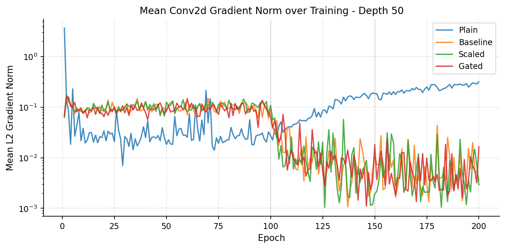

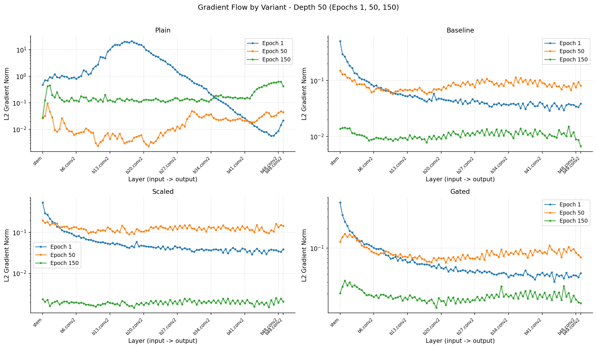

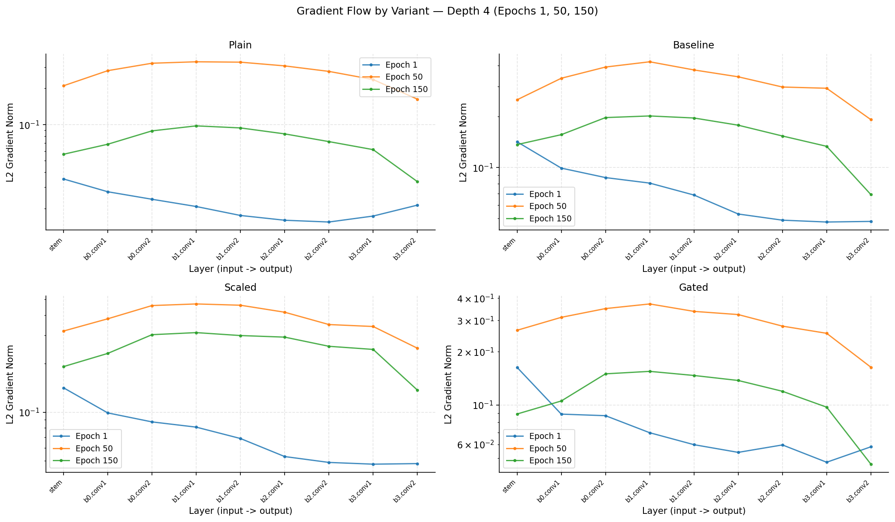

### 9.7 Cross-Variant Comparison

The per-variant analyses in the preceding subsections are consolidated here into a direct comparison at depth 50, where the four variants separate most clearly. The two research questions of Section 4 (Problem Statement) are addressed in turn against the depth-50 validation and test numbers.

#### Does each residual variant solve the degradation problem?

The margin over Plain at depth 50 is reported in the table below for both validation and test.

| Variant  | Solves degradation? | Margin over Plain at depth 50 (val / test) |
|----------|---------------------|--------------------------------------------|
| Baseline | Yes                 | +16.62 pp / +17.04 pp                      |
| Scaled   | Yes                 | +16.76 pp / +17.28 pp                      |
| Gated    | Yes                 | +17.08 pp / +17.66 pp                      |

All three residual variants clear the Plain network by more than 16 percentage points of validation accuracy and more than 17 percentage points of test accuracy at depth 50. Every margin is more than fifty times the single-seed noise band of ±0.2 to 0.3 percentage points, so the answer to RQ1 is unambiguous on this implementation.

#### Do the more complex Scaled and Gated variants outperform Baseline?

Gated provided a small but consistent improvement over Baseline on both validation and test at depth 50. Validation accuracy reached 93.62% against Baseline's 93.16%, and test accuracy reached 92.82% against Baseline's 92.20%, gaps of 0.46 and 0.62 percentage points that both clear the single-seed noise band of ±0.2 to 0.3 percentage points. Scaled's results were marginal against Baseline and are examined in Section 9.4 (Scaled Residual). Gated is therefore the only routing mechanism in the experimental grid that meaningfully outperforms the simple identity shortcut at the depths considered.

### 9.8 Computational Overhead

This subsection looks to quantify the parameter overhead and wall-clock cost introduced by the Scaled and Gated variants relative to the Plkain and Baseline variants in our study.

Parameters: The four variants use a similar macro-architecture (stem, flat block stack, classification head) and the same convolutional pathway F(x) inside each block. Scaled utilizes an independent α ∈ R C per block (C = 64 parameters per block). Gated introduces a 1x1 consultation with bias per block (C^2 + C = 64^2 + 64 = 4,160 parameters per block). Plain and Base lack these added complexities and therefore are identical in size.

| Variant  | Depth 4 | Depth 32  | Depth 50  | Extra params/block |
|----------|---------|-----------|-----------|--------------------|
| Plain    | 298,442 | 2,369,994 | 3,701,706 | 0                  |
| Baseline | 298,442 | 2,369,994 | 3,701,706 | 0                  |
| Scaled   | 298,698 | 2,372,042 | 3,704,906 | 64                 |
| Gated    | 315,082 | 2,503,114 | 3,909,706 | 4,160              | 

The Scaled variant’s addition of 64  additional scalars per block is a negligible size of only 0.09% f the total parameters at each depth. Gated provides a much higher, but still relatively small, overall increase. With 4160 parameters per block at a depth of 50. Because neither variant includes additional weight matrices, the added complexity can be attributed to their individual routing mechanisms. 

| Variant  | Depth 4 avg/total | Depth 32 avg/total | Depth 50 avg/total |
|----------|-------------------|--------------------|--------------------|
| Plain    | 5.5 s / 18.3 min  | 31.0 s / 1 h 43 m  | 47.9 s / 2 h 40 m  |
| Baseline | 5.5 s / 18.3 min  | 32.8 s / 1 h 49 m  | 50.7 s / 2 h 49 m  |
| Scaled   | 5.6 s / 18.7 min  | 32.7 s / 1 h 49 m  | 54.9 s / 3 h 03 m  |
| Gated    | 5.7 s / 19.1 min  | 42.0 s / 2 h 20 m  | 65.4 s / 3 h 38 m  |

Cost/benefit evaluation: Using the data introduced in Section 7.7, we are able to make a direct evaluation of whether the added complexity of Scaled and Gated aided in our network's efficiency and accuracy.

For Scaled, the cost of the added 64 scalars per block has nearly no measurable impact on wall-clock time and was nearly identical to our results of the Plain residual network for every depth, taking only 4.3 seconds slower on depth-50, a negligible amount. In conclusion, the scaled variant of the residual network provided no distinguishable benefit, and does not constitute its additional parameters, though how small they are. 

Gated, with it’s 5.6% parameter increase at depth-50, and saw a 14.7 second increase in the overall time per epoch versus the plain variant. At depth-50, we see an increased on validation and test of +0.46 pp and +0.62 pp, respectively. These numbers on CIFAR-10 do provide a meaningful gain in performance at the cost of time, but depending on the application, these gains with the trade-off of complexity and time could make this variant not worth the additional complexity. 

---

# 10. Conclusions

The depth-induced degradation problem was reproduced in the Plain network, with training error rising from 0.13% at depth 4 to 20.84% at depth 50 and validation accuracy collapsing from 90.44% to 76.54% in parallel. The simultaneous failure on both training and validation matches the optimization-failure framing of He et al. (2015) and rules out overfitting as the cause.

In contrast, all three residual variants eliminated the degradation problem at every depth tested, with each reaching essentially 100% training accuracy and clearing the depth-50 Plain network by more than sixteen percentage points of validation accuracy. The fix is attributable to the additive identity path through the block, which preserves a direct gradient route to earlier layers (Goodfellow §8.2.5).

Among the residual variants, the simple identity shortcut of the Baseline variant remained competitive with the more elaborate Scaled and Gated alternatives. Scaled tied Baseline at every depth within single-seed noise on both validation and test. Gated produced a small but consistent improvement only at depth 50, with margins of 0.46 percentage points on validation and 0.62 percentage points on test that both clear the noise band.

In summary, the reproduction question of whether each residual variant solves the degradation problem is answered in the affirmative for all three. For the comparison question of whether the more complex Scaled and Gated variants outperform the simpler Baseline residual, Scaled was statistically indistinguishable from Baseline at every depth, and Gated outperformed Baseline by a small but consistent margin at depth 50.

---

# 11. Limitations

The conclusions reported in Section 10 (Conclusions) rest on a deliberately narrow experimental scope. The limitations of that scope are listed below, both to qualify the strength of the present claims and to delimit which questions are left open for future work.

- **Single dataset.** The study used only CIFAR-10. The variant ranking has not been validated on CIFAR-100, ImageNet, or any non-vision modality.
- **Single seed per run.** Each run was trained with a single random seed (42). Without multiple seeds, accuracy gaps smaller than the ±0.2 to 0.3 percentage point single-seed noise band cannot be distinguished from seed variance, which limits the strength of within-residual claims.
- **No dropout ablation.** Dropout was deliberately omitted from all runs to keep the routing-variable ablation clean (Section 6.1 (Shared Block Structure)). Whether adding dropout would change the within-residual ranking is not measured here.
- **No state-of-the-art training tricks.** Cutout, mixup, label smoothing, stochastic depth, and test-time augmentation are all absent. The accuracy numbers reported here should not be compared against modern CIFAR-10 leaderboards.

Some of these limitations point toward a concrete follow-up that would tighten or extend the present findings. Those follow-ups are catalogued in Section 12 (Future Work).

---

# 12. Future Work

The four-variant ablation in this paper is limited in scope. A single
dataset, a single seed per cell, a fixed flat-64 macro-architecture, and three
depths are not enough to paint the full picture. Each of the following directions removes one of those restrictions and
turns these limitations into prospective follow-up studies.

- **Multi-seed runs with confidence intervals.** The single most defensible
  next step. Rerunning all experiments with at least five seeds and reporting mean $\pm$ standard
  error would let us state whether the depth-50 Gated advantage is real or an
  artifact of the single seed used here.

- **Cross-dataset validation.** Repeat the full ablation on CIFAR-100 and
  Tiny-ImageNet, holding the architecture and training protocol fixed. CIFAR-100
  shares CIFAR-10's image distribution but is harder per-class; Tiny-ImageNet
  introduces 64$\times$64 inputs and 200 classes. If the variant ranking is
  consistent across all three datasets, then there's a stronger generalization
  claim.

- **Extension to extreme depths (110 / 1202 layers):** Our depth ladder (4 / 32 / 50) sits below the original Resnet 2015 depth regime and may be
  systematically *under-resolving* the Scaled and Gated advantages. Repeating
  at depths 110 and 1202 would either replicate He et al.'s headline finding
  (with our four-variant lens) or
  suggest that BatchNorm plus the flat-64 macro-architecture has its own
  upper-depth ceiling distinct from the residual mechanism. Either outcome is
  publishable.

---

# 13. References

**TODO:** all members (verify their cited works)
**Target length:** 1 – 1.5 pages

Start from the proposal's bibliography (Refs [1]–[10]). **Additions required:**

- He et al. 2015 (already present as [3]) — verify CVPR 2016 citation is preserved.
- Krizhevsky 2009 (already present as [6]) — CIFAR-10 tech report.
- Hochreiter 1998 (already present as [4]).
- Goodfellow, Bengio, Courville — *Deep Learning*, MIT Press 2016. Cite specifically Ch. 5 (capacity), Ch. 6 (MLPs/backprop), §7.12 (dropout), §8.2.5 (vanishing/exploding gradients), §8.3 (momentum), §8.5 (adaptive methods), §8.7.1 (BatchNorm).
- Bishop — *Pattern Recognition and Machine Learning*, Springer 2006. Cite §1.1 (hypothesis space), §3.2 (bias-variance), §5.1 (universal approximation), §5.3 (backprop).
- Murphy — *Machine Learning: A Probabilistic Perspective*, MIT Press 2012. Cite §6.4 (bias-variance), Ch. 11 (clustering — peripheral, may drop).
- Bachlechner et al. 2020 — *ReZero is All You Need* (for Scaled variant lineage).
- Touvron et al. 2021 — *LayerScale / CaiT* (for Scaled variant lineage).
- Huang et al. 2016 — *Stochastic Depth* (only if used in Future Work).
- Loshchilov & Hutter 2017 — *Cosine annealing / SGDR* (optional, if mentioned in §8.3).

Use a consistent style (`alpha` or numeric — match the proposal's existing style).